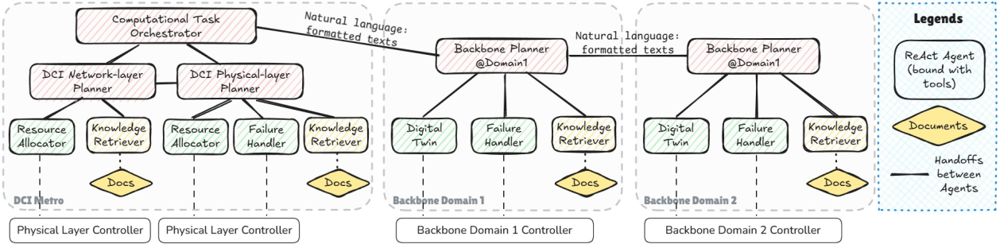

Supporting information for the paper:

**First Field-Trial Demonstration of Level-4 Autonomous Optical Networks for Distributed Training Communication: An LLM-powered Multi-AI-Agent Solution**

## Directories

* `tasks` — description of the tasks, checkpoints, and scoring criteria for task completion rates in this paper.
* `paper_figs` — data for **Figure 3(b)** and  **Figure 3(c)** in the paper.

## Framework of AutoLight

